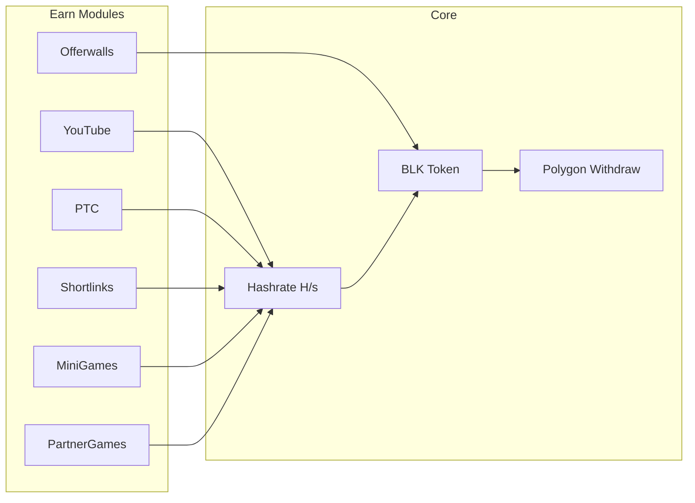

# Relatório Geral — BlockMiner 2.1 (Julho 2026)

Documento de handoff completo para outro LLM ou auditor técnico. Última actualização com base no repo local e na VPS de produção.

---

## 1. O que é o produto

**BlockMiner** é uma simulação de mineração Web3 em formato web app. O utilizador **não minera cripto real** no browser — acumula **hashrate (H/s)** através de actividades (vídeos, offerwalls, PTC, check-in, mini-games, shortlinks, auto-mining) e converte isso em **BLK**, token interno sacável na rede **Polygon**.

**Game-loop:** actividade do jogador → receita publicitária (Zerads, OfferwallMe, PTC, YouTube, shortlinks) → parte volta ao jogador como BLK → saque on-chain.

| Item | Valor |
|---|---|
| Domínio público | `https://blockminer.space` |
| Repo local | `/home/gustavo/Documentos/BlockMiner 2.1` |
| Branch activa | `chore/dead-code-cleanup` |
| Estado git | **~97 ficheiros modificados + ~30 untracked** (muito trabalho **não commitado**) |
| Deploy | VPS `89.167.119.164`, path `/root/block-miner-v3` |
| Deploy script | `scripts/vm-deploy-local-over-ssh.py` (zip da working tree via SSH, **não** `git pull` no servidor) |

---

## 2. Stack tecnológica

### Backend
- **Node.js 20** (Docker `node:20-bookworm-slim`)
- **TypeScript** — compilado com `tsc` (`tsconfig.server.json` + `backend/tsconfig.json`)
- **Express 5** — API HTTP
- **Socket.io 4** — realtime (mining, jogos, chat)
- **PostgreSQL 15** + **Prisma 7** (`@prisma/adapter-pg`, pool max 40 na app, 12 no worker)
- **Redis 7** + **BullMQ 5** — filas assíncronas
- **node-cron** — tarefas agendadas
- **Zod** — validação de input
- **JWT + bcrypt** — auth; 2FA opcional (TOTP ou email)
- **ethers 6** — Web3 server-side
- **nodemailer** — SMTP Hostinger porta **587** (465 bloqueada na VM)

### Frontend
- **React 19** + **Vite 7** + **TailwindCSS**
- **React Router 7** — ~40+ páginas
- **React Query 5** — cache/fetch
- **Zustand** — state global (auth, wallet)
- **Wagmi 3 + viem** — carteira Web3
- **i18next** — pt-BR, en, es
- **framer-motion**, **Recharts**, **Sonner**

### Infra
- **Docker Compose** — 6 containers fixos:
  - `block-miner-db` (Postgres)
  - `block-miner-redis`
  - `block-miner-app` (API + SPA estática)
  - `block-miner-worker` (BullMQ)
  - `block-miner-telegram-worker`
  - `block-miner-nginx` (TLS Let's Encrypt, Cloudflare)
- **Hardhat** — contratos Solidity (`contracts/`), rede Polygon

### Documentação interna
- Ficheiro principal: [`docs/PROJECT_OVERVIEW.md`](PROJECT_OVERVIEW.md) (~1370 linhas, 5 partes: stack, arquitectura, schema, infra, fluxos críticos)
- Este relatório: [`docs/RELATORIO_GERAL_JUL2026.md`](RELATORIO_GERAL_JUL2026.md)

---

## 3. Arquitectura — monolito modular

Um **único processo Node** serve API + SPA. Código organizado por domínio em `server/modules/` (~35 módulos). Módulos **não importam entre si** — só de camadas partilhadas (`server/services/`, `server/utils/`, Prisma).

```
dist/server/server.js          ← entrypoint
  └─ backend/                 ← composição HTTP Express
       └─ mount/userApiRoutes.mount.ts  ← app.use("/api/...")
            └─ server/modules/*/routes  ← domínios
```

**Camadas por módulo (convenção):**
`*.routes.ts` → `*.controller.ts` → `*.service.ts` → `*.repository.ts` + `*.schemas.ts` + `*.types.ts`

**Workers separados (mesmo código, outro processo):**
- `block-miner-worker` — BullMQ (ciclos BLK, IP enrichment, torneios outbox)
- `block-miner-telegram-worker` — notificações Telegram via outbox

**Sockets:** handlers em `server/src/socket/registerGamesSocketHandlers.ts` e `registerMinerSocketHandlers.ts`.

**Schema Prisma:** `server/prisma/schema.prisma` — **~100 models**, **100 migrations** aplicadas em produção.

---

## 4. Módulos backend (`server/modules/`)

| Módulo | Função |
|---|---|
| `auth` | Login, registo, refresh token, 2FA |
| `wallet` | Carteira, depósitos CCPayment, saques Polygon |
| `checkin` | Check-in diário + streak + recovery |
| `faucet` | Faucet + visitas parceiro |
| `youtube` | Watch & earn (H/s por minuto visto) |
| `ptc` | Paid-to-click (Zerads) |
| `zerads` | Webhook offerwall Zerads |
| `offerwallme` | Webhook OfferwallMe |
| `internal-offerwall` | Offerwall interno (tarefas iframe) |
| `shortlinks` | Shortlink power (via controller legado + model) |
| `auto-mining` | Auto-mining GPU v1 + v2 (presence/heartbeat) |
| `games` | Cooldown engine, anti-cheat v2, session lock, burst guard |
| `partnerGames` | Jogos parceiros iframe/external + heartbeat rewards |
| `tournaments` | Engine de torneios + scorers + outbox incremental |
| `machines` / `inventory` / `rooms` / `vault` | Rack, inventário, salas, cofre |
| `shop` / `burnEvents` / `reward-inbox` | Loja, eventos burn, inbox de rewards |
| `mini-pass` (via services) | Season pass com missões XP |
| `tasks` | Daily tasks |
| `energy-tax` | Taxa de energia / bloqueio |
| `powerBoost` | Banners power boost |
| `stats` / `traffic` | Estatísticas, atribuição UTM |
| `referrals` | Referrals (novo) |
| `social` | Social/creators |
| `support` / `publicSupport` | Suporte |
| `admin-miners` | Admin CRUD miners |
| `ip-intelligence` | Enriquecimento IP anti-fraude |
| `pricing` | Oracle preços (CoinGecko) |
| `broadcast` | Mensagens broadcast |

**Rotas legadas:** `server/routes/` (~45 ficheiros) coexistem com módulos — migração gradual.

---

## 5. Frontend — páginas principais

| Área | Páginas |
|---|---|
| Auth | Login, Registo |
| Dashboard | Dashboard, Ranking, Stats, Transparência |
| Earn | YouTube Watch, PTC, Internal Offerwall, Shortlinks, Offerwall, OfferwallMe, Read & Earn |
| Games | Games hub, GameSession (socket), Game2048, Partner Games, Verify |
| Mining | Auto-mining GPU, Machines, Calculator |
| Economy | Wallet, Vault, Shop, Taxes/Energy, Burn Events |
| Social | Referrals, Social, Creator (novo) |
| Progressão | Check-in, Daily Tasks, Mini Pass, Tournaments |
| Admin | ~20 páginas (Users, Analytics, Finance, Tournaments, Partner Games, Fraud, etc.) |
| Legal | Terms, Manual, Roadmap, Landing |

**i18n:** `client/src/i18n/locales/` — pt-BR, en, es.

---

## 6. Sistemas de jogo

### 6.1 Mini-games (Socket.io)

Jogos via WebSocket: `crypto-memory`, `crypto-match-3`, `cart-rush`, `block-stack`, `sky-runner`.

**Fluxo vitória (`finishGame`):**
1. Anti-cheat V2 (`gameAntiCheatV2.ts`) — trust score, tempo mínimo
2. Burst guard (`gameBurstGuard.ts`) — 2× COUNT + flag audit se suspeito (dedupe 1/min)
3. `userPowerGame.create` — +25 H/s por X dias (7d com check-in, 24h sem)
4. `gameSessionLog.create` — log anti-fraude
5. `recordFinish` — cooldown progressivo (10s base, +10s/10 sessões, cap 300s)
6. `recordTournamentAction` — torneio MINIGAME_WINS
7. Mini-pass + daily tasks hooks
8. Audit `MINIGAME_PLAYED_REWARD`
9. `syncUserBaseHashRate` — recalcula hashrate em memória

**Anti-farm (deployado 9 jul 2026):**
- `gameActiveSessionLock.ts` — **1 sessão activa por user+gameSlug** (bloqueia multi-aba)
- `gameBurstGuard.ts` — flag `MINIGAME_BURST_SUSPECT` (não bloqueia reward; máx. 1 audit/user+game/minuto)
- i18n `game_already_active` em pt/en/es
- **NÃO implementado:** rate limit 1 reward/minuto (pedido explicitamente rejeitado)

### 6.2 Partner Games

Jogos externos embedados ou link externo (`launchMode`: `iframe` | `external`).

**Features recentes:**
- Heartbeat a cada 30s (`usePartnerGameSession.ts`)
- Reward por minuto de jogo activo (presence + iframe loaded)
- Embed probe/sync (`partner-games.embed-probe.ts`, `embed-sync.ts`)
- CSP allowlist dinâmica para domínios parceiros (ex: minercore.online)
- Migrations: launch_mode, embed_probe, minercore external_only

### 6.3 Game 2048

Jogo separado com engine partilhada (`game2048Engine.ts` compilada no server e copiada pro client build).

---

## 7. Torneios

Engine incremental com outbox pattern (BullMQ + `tournament_domain_outbox`).

**Métricas suportadas:** `HASHRATE`, `BLOCKS_MINED`, `CHECKINS`, `TASKS_COMPLETED`, `DEPOSITS_POL`, `DEPOSITS_USD`, `OFFERS_INTERNAL`, `OFFERS_EXTERNAL`, `OFFERS_ALL`, **`MINIGAME_WINS`** (novo).

**MINIGAME_WINS:**
- Scorer: `server/modules/tournaments/domain/metrics/minigame.scorer.ts`
- Acção registada em `finishGame` via `recordTournamentAction` com `providerEventId: upg:{id}`
- Migration: `20260708180000_tournament_minigame_wins`
- Torneio activo em produção: **#25 Daily Game Tournament**

---

## 8. Reset diário — timezone Brasil

Vários módulos migraram de UTC para **meia-noite America/Sao_Paulo**:

| Módulo | Limite diário | Ficheiro chave |
|---|---|---|
| YouTube | **1000 H/s** por dia Brasil | `youtube.service.ts`, `DAILY_LIMIT_HASH` |
| Internal Offerwall | reset Brasil | `internal-offerwall.period.ts` |
| Shortlinks | reset Brasil | `shortlinkModel.ts` |
| Auto-mining GPU | reset Brasil + fix instant-grant | `auto-mining.v2.service.ts` |
| PTC | reset UTC (migration separada) | `ptc.utc.ts` |

**Util partilhado:** `server/utils/brazilDayBounds.ts`
**Hook client:** `client/src/shared/hooks/useBrazilDailyResetCountdown.ts`

---

## 9. Auto-mining GPU v2 — bug corrigido

**Problema:** ao abrir a página, concedia +5 H/s imediatamente sem presença verificada.

**Fix (deployado):**
- `hasVerifiedPresence` — só conta tempo após heartbeat confirmado
- `resyncSessionAfterAbsence` — debita tempo ausente
- Client: `presenceReadyRef` — não claim antes do primeiro heartbeat
- Labels UI actualizados para timezone Brasil

---

## 10. Incidente TeaH4nd — farm multi-aba (resolvido)

| Campo | Valor |
|---|---|
| User | TeaH4nd (id 358) |
| Email | lechamon@hotmail.com |
| Padrão | 10 vitórias/minuto em `crypto-memory`, multi-aba |
| Score torneio #25 | 177 (antes de apagar) |
| Vitórias totais | 3.361 (100% crypto-memory) |
| Conta | **Apagada da BD** em 2026-07-09 15:00 UTC |

**Export guardado em:** `reports/account-deletions/TeaH4nd-358/` (REPORT.md, summary.json, user.json; full-export.json ~21MB local only)

**Script:** `scripts/admin/export-delete-user.mjs` — exporta todas as tabelas + purge FK RESTRICT + `user.delete()` cascade.

**Nota histórica:** 24k audits `MINIGAME_PLAYED_REWARD` pré-3-jul sem `game_session_logs` (feature session log era posterior). Ratio 1:1 desde 3 jul.

**Outro suspeito:** `@playtowincrypto` (id 90) — 99 wins/24h pré-deploy, **0 wins após session lock**.

---

## 11. Produção — estado actual (9 jul 2026)

- Health: app + nginx operacionais pós-deploy
- Migrations: 100/100 aplicadas, sem pendentes
- Burst guard: 0 flags nas últimas 24h (deploy recente)
- Session lock: efectivo (playtowincrypto parou após deploy)
- Audit logs 24h: ~557 MINIGAME_PLAYED_REWARD vs ~435 session logs (178 null user_id = TeaH4nd SET NULL)

**Deploy method:** zip da working tree (inclui uncommitted) → SFTP → docker compose build → migrate deploy. **Não depende de git no servidor.**

---

## 12. Verificação flood de queries (auditado)

**Não há loop infinito de storage**, mas cada vitória de minigame faz ~10-15 ops DB:

```
burst guard (2 COUNT) → checkin SELECT → power INSERT → cooldown UPSERT
→ session log INSERT → tournament action + outbox → mini-pass/tasks
→ audit INSERT → syncUserBaseHashRate (5 SELECTs) → cooldown SELECT
```

`game:action` (flips, lanes) = **só memória**, sem BD.

**Burst guard dedupe:** no máximo 1 audit `MINIGAME_BURST_SUSPECT` por user+game+minuto (in-memory, por processo Node).

---

## 13. Git — trabalho recente (resumo)

**Branch:** `feat/jul2026-platform-handoff` (commit dedicado com todo o trabalho pendente).

### Áreas principais:
- Brazil daily reset (youtube, shortlinks, offerwall, auto-mining)
- Partner games (embed, launch mode, heartbeat, CSP)
- Tournaments MINIGAME_WINS (engine, admin, UI, backfill script)
- Anti-farm (session lock, burst guard + dedupe, socket handlers)
- PTC UTC reset
- UI: tournaments, youtube, ptc, shortlinks, auto-mining, partner games
- Tests: `ptc.daily-reset.test.mjs`, `brazilDayBounds.test.mjs`, removido `ptc.cooldown.test.mjs`
- Relatório: `docs/RELATORIO_GERAL_JUL2026.md`

---

## 14. Testes

```bash
npm test                    # node scripts/run-node-tests.mjs (após build)
npm run test:mini-pass
npm run test:read-earn
npm run test:offer-events
npm run coverage:gate       # server utils 80% lines
```

Testes novos: `brazilDayBounds`, `ptc.daily-reset`, `internal-offerwall.period`, `referrals.stats.since`.

---

## 15. Fluxos críticos de negócio (resumo)



**Fluxos documentados em detalhe:** registo, login, mining cycle, check-in, offerwall callback, depósito Polygon, saque, faucet, audit chain — ver Parte 5 de `PROJECT_OVERVIEW.md`.

---

## 16. Segurança e anti-fraude

| Camada | Mecanismo |
|---|---|
| HTTP | helmet, CORS, rate-limit (memória), CSRF |
| Auth | JWT access+refresh, lockout, 2FA opcional |
| Jogos | Anti-cheat V2 trust score, cooldown progressivo, session lock |
| Farm | Burst flag audit (review admin, não bloqueia; dedupe 1/min) |
| IP | `ip-intelligence` module, fraud signals admin |
| Audit | `audit_logs` table + audit chain tamper-evident |
| Withdrawals | Telegram worker proof, admin approval |

---

## 17. Riscos e pendências

| Item | Prioridade | Estado |
|---|---|---|
| Commitar alterações pendentes | Alta | Feito em `feat/jul2026-platform-handoff` |
| Dedupe burst guard audit | Média | Feito |
| Reconciliar leaderboard torneio #25 pós-delete TeaH4nd | Baixa | Pendente |
| Rever @playtowincrypto | Média | Parou após lock, conta activa |
| `syncUserBaseHashRate` não persiste BD (só memória engine) | Info | By design |
| Rate limit 1 reward/min | — | **Rejeitado pelo owner** |
| Credenciais VM em `vm_config_secret.py` | Segurança | Gitignored, não commitar |

---

## 18. Comandos úteis

```bash
# Dev local
npm run dev

# Build
npm run build:server && npm run build:backend && npm run build:client

# Deploy produção (da máquina local)
python3 scripts/vm-deploy-local-over-ssh.py
# ou com zip explícito:
BLOCKMINER_DEPLOY_ZIP=/tmp/blockminer-deploy.zip python3 scripts/vm-deploy-local-over-ssh.py

# Migrations
npm run db:migrate

# Export+delete user (dentro do container)
node scripts/admin/export-delete-user.mjs --username USERNAME --out /app/reports/account-deletions/USER
```

---

## 19. Contexto para o ChatGPT

Se fores continuar trabalho neste projeto:

1. **Lê primeiro** `docs/PROJECT_OVERVIEW.md` — é a fonte de verdade arquitectural.
2. **Este relatório** (`docs/RELATORIO_GERAL_JUL2026.md`) resume o estado de julho 2026.
3. **Monolito modular** — módulos não importam entre si; montagem HTTP em `backend/src/app/mount/`.
4. **Prisma schema único** — qualquer mudança de BD precisa migration em `server/prisma/migrations/`.
5. **Jogos = Socket.io**, não REST — anti-cheat e rewards em `registerGamesSocketHandlers.ts`.
6. **Timezone Brasil** é o padrão novo para resets diários de earn modules.
7. **Session lock + burst dedupe** em produção após deploy de 9 jul 2026.
8. **TeaH4nd foi apagado** — relatório em `reports/account-deletions/TeaH4nd-358/`.

---

*Fim do relatório. Gerado a partir do repo BlockMiner 2.1 e auditoria VPS 89.167.119.164 em 9 jul 2026.*
